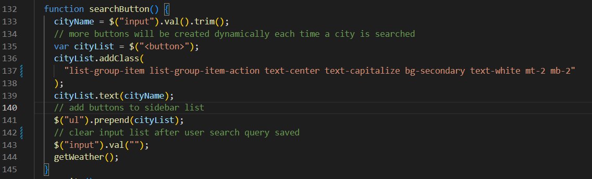
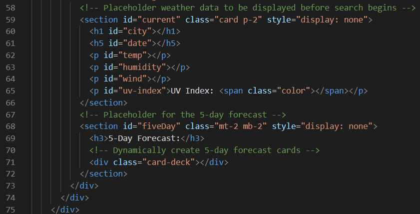
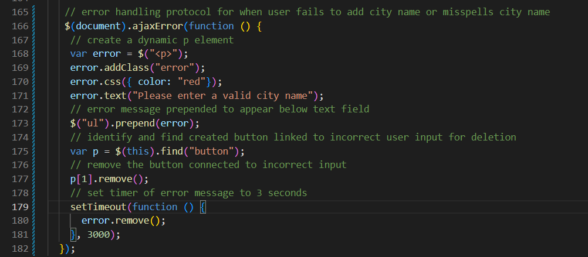
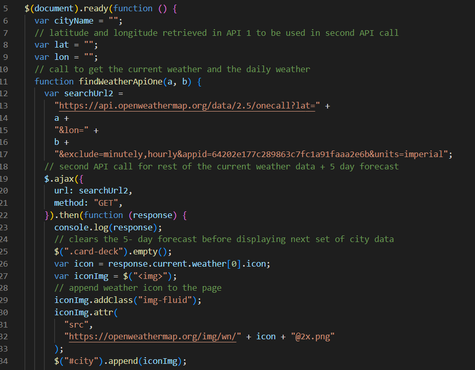
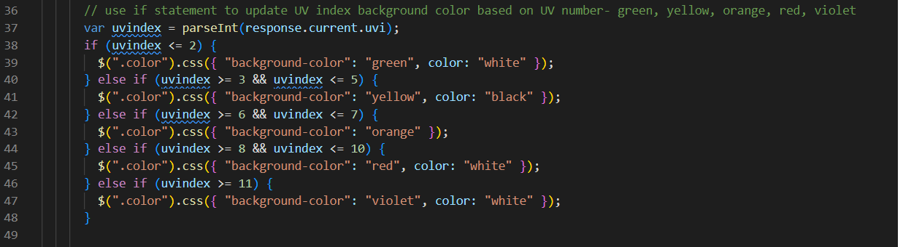
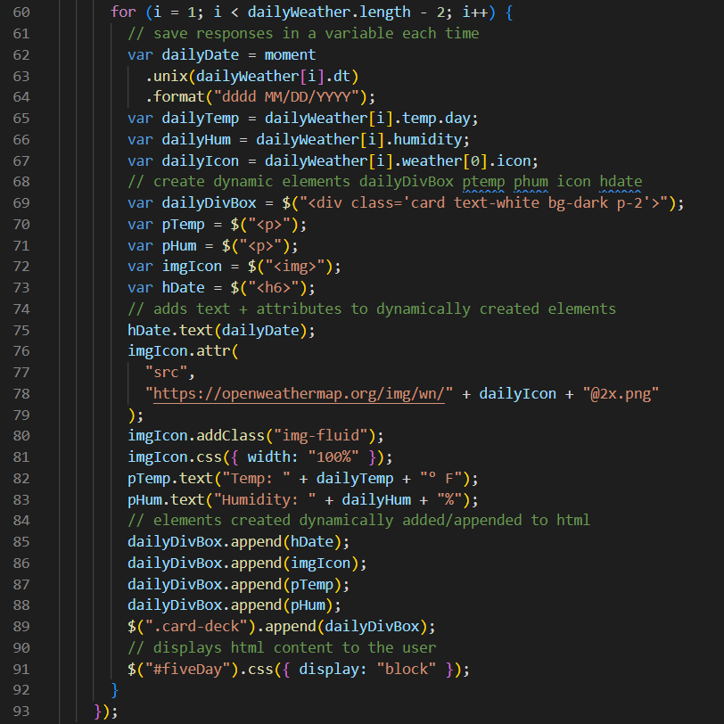
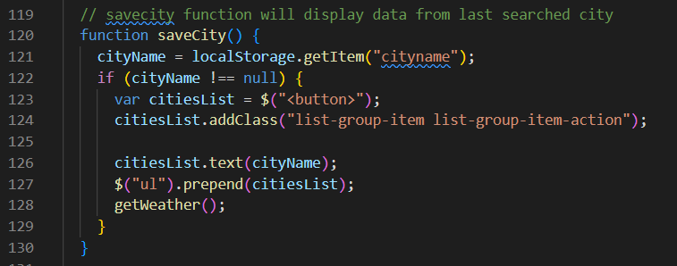

# Wetha-Wizard

## General Info
The purpose of this challenge was to create a working weather dashboard capable of displaying a city's current weather alongside a 5-day forecast. The user's previous searches needed to be saved to be used later and the weather fields needed accompanying icons as well.

## Creating Weather Dashboard Layout
I originally tried to hard code the html page but was having difficulties organizing the div boxes for each piece. I created loops that would create buttons for previously searched cities. I set up the basic divs for the different sections I would need and added in ids for the data to be displayed on my cards. This would help me append the data to the correct positions later on.

The cards for the 5 day forecast were set up with bootstrap stylings and the div for the current weather data were created in html to house the data to be displayed either in the current weather div or in the 5 day forecast cards.

To ensure the user could not generate search buttons for incorrect/invalid searches, I created a function that would alert the user and also delete the box created by the savecity function.

## Pulling Weather Data
To display the current weather data for the cities searched and to populate the 5-day forecast box, I needed to use the OpenWeatherApi to make calls for the different results I wanted to display. I had to make two separate API calls to grab data for the current weather section and for the 5-day forecast cards. 

### Current Weather
To get the data for the current weather I needed to specify through the api which endpoints I wanted to use and then match those with the html element(by id) so that they would be displayed for the user.

The UV Index icon needed to change according to the value so to do that I used an if statement that would change the icon color when the value was within, below, or above specific numbers.

### 5-Day Forecast
Similar to getting the data for the current weather, I needed to specify which endpoints I wanted returned for the five day forecast. The data results were then appended to the different cards and the date feature was handled by moment.js. I used a for loop to get data for multiple days and set the loop length to -2 since the api was set to return data for 7 days by default and I only needed 5.

## Storing Data
To save the cities searched I set the cityname variable to local storage and used that to generate buttons if the input was not null. This allowed me to create a dynamic list of city names that would appear while the user was actively putting in different city names.

## Links

Github Repository: https://github.com/hvphan1993/Wetha-Wizard.git

Active Link: https://hvphan1993.github.io/Wetha-Wizard/